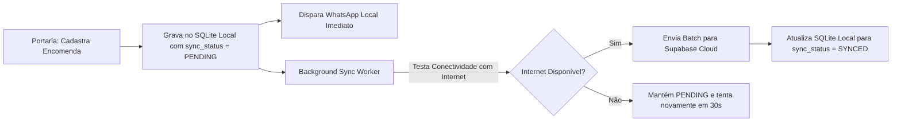

# Especificação Técnica: Banco Local SQLite Offline-First & Sincronização

## 1. Visão Geral
Implementar uma camada de persistência local autônoma em **SQLite** (`better-sqlite3` ou `sqlite3`), garantindo que o CondoBox funcione com 100% de autonomia e velocidade máxima na portaria, mesmo em caso de falha total de internet.

---

## 2. Estrutura do Banco Local (`condobox.db`)

O banco SQLite local conterá as tabelas essenciais para a operação da portaria:

```sql
-- Unidades do Condomínio
CREATE TABLE IF NOT EXISTS units (
    id TEXT PRIMARY KEY,
    condo_id TEXT NOT NULL,
    block TEXT NOT NULL,
    unit_number TEXT NOT NULL,
    created_at DATETIME DEFAULT CURRENT_TIMESTAMP,
    updated_at DATETIME DEFAULT CURRENT_TIMESTAMP
);

-- Moradores
CREATE TABLE IF NOT EXISTS residents (
    id TEXT PRIMARY KEY,
    unit_id TEXT NOT NULL,
    name TEXT NOT NULL,
    phone TEXT NOT NULL,
    email TEXT,
    is_primary INTEGER DEFAULT 0,
    active INTEGER DEFAULT 1,
    created_at DATETIME DEFAULT CURRENT_TIMESTAMP,
    updated_at DATETIME DEFAULT CURRENT_TIMESTAMP,
    FOREIGN KEY (unit_id) REFERENCES units(id) ON DELETE CASCADE
);

-- Encomendas
CREATE TABLE IF NOT EXISTS packages (
    id TEXT PRIMARY KEY,
    condo_id TEXT NOT NULL,
    unit_id TEXT NOT NULL,
    resident_id TEXT,
    carrier TEXT NOT NULL,
    tracking_code TEXT,
    recipient_name_ocr TEXT,
    label_image_path TEXT,
    signature_image_path TEXT,
    delivered_to_name TEXT,
    pickup_code TEXT NOT NULL,
    qr_token TEXT NOT NULL,
    status TEXT NOT NULL DEFAULT 'RECEIVED', -- RECEIVED, NOTIFIED, DELIVERED
    received_at DATETIME DEFAULT CURRENT_TIMESTAMP,
    delivered_at DATETIME,
    notes TEXT,
    sync_status TEXT DEFAULT 'PENDING', -- PENDING, SYNCED, FAILED
    last_synced_at DATETIME,
    FOREIGN KEY (unit_id) REFERENCES units(id),
    FOREIGN KEY (resident_id) REFERENCES residents(id)
);

-- Log de Notificações
CREATE TABLE IF NOT EXISTS notifications_log (
    id TEXT PRIMARY KEY,
    package_id TEXT NOT NULL,
    resident_id TEXT,
    recipient_phone TEXT NOT NULL,
    message_content TEXT NOT NULL,
    status TEXT NOT NULL, -- SENT, FAILED, PENDING
    error_message TEXT,
    sent_at DATETIME,
    created_at DATETIME DEFAULT CURRENT_TIMESTAMP,
    FOREIGN KEY (package_id) REFERENCES packages(id) ON DELETE CASCADE
);
```

---

## 3. Mecanismo de Sincronização Híbrida (Background Sync Worker)



### Regras de Sincronização:
1. **Prioridade Local**: As operações de escrita (cadastro de encomenda, baixa com assinatura digital) são gravadas **imediatamente** no SQLite local (tempo de resposta < 5ms).
2. **Resiliência a Falhas**: Se a nuvem estiver indisponível ou com lentidão, o porteiro nunca trava e continua trabalhando sem atrasos.
3. **Pull Periódico de Moradores**: A cada 10 minutos (quando online), o sistema faz o download de novos moradores/unidades atualizados no portal web/app do síndico.
