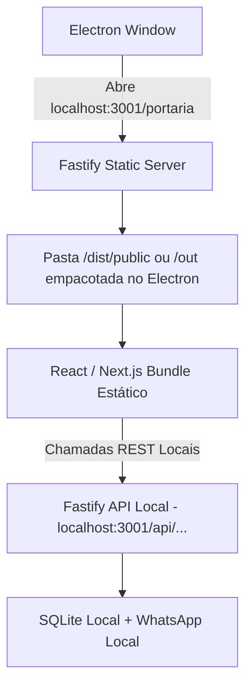

# Especificação Técnica: Frontend Embutido e Operação Offline-First

## 1. Visão Geral
Eliminar a dependência de carregar a interface da portaria a partir da URL da Vercel (`web-eight-rust-97.vercel.app`), empacotando os ativos visuais compilados do Next.js diretamente dentro da aplicação desktop e servindo-os localmente através do Fastify (`http://localhost:3001`) ou protocolo local do Electron.

---

## 2. Como Funciona

---

## 3. Benefícios de Operação
* **Carregamento Instantâneo**: A tela de portaria abre em milissegundos sem depender de DNS, latência de rede ou disponibilidade do servidor da Vercel.
* **Operação 100% Offline**: Permite leitura de etiquetas com OCR local (Tesseract), captura de foto da webcam/câmera USB, assinatura digital na tela e impressão térmica de comprovantes sem internet.
* **Fallback Inteligente de Conectividade**:
  * Indicador visual no canto superior da tela ("Modo Local / Offline" vs "Sincronizado com a Nuvem").
